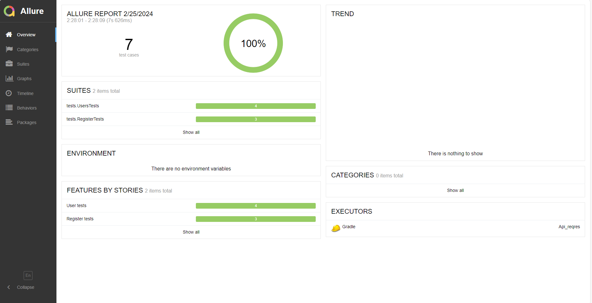

# Дипломный проект по автоматизации тестирования API сайта [reqres.in](https://reqres.in/)


<a id="tools"></a>
## Технологии и инструменты


<code>Gradle</code> — для автоматизации сборки\
<code>JUnit5</code> — для выполнения тестов\
<code>REST Assured</code> — для тестирования REST-API сервисов\
<code>Allure Report</code> — для визуализации результатов тестирования

## Реализованные проверки

<code>Пользовательские проверки</code>
-  Создание пользователя с валидным именем и профилем деятельности
-  Изменение имени существующего пользователя
-  Удаление существующего пользователя
-  Получение информации о существующем пользователе

<code>Проверки на регистрацию пользователя</code>
-  Регистрация пользователя
-  Регистрация пользователя без указания пароля
-  Регистрация пользователя без указания почты

### Локальный запуск тестов

```
gradle clean test
```

## </a> Отчет о результатах тестирования в Allure Report

<p align="center">
  
</p>
